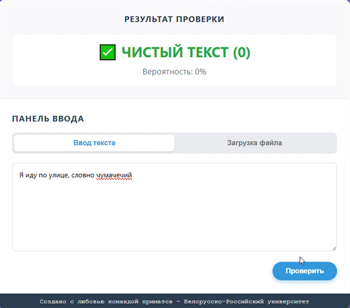
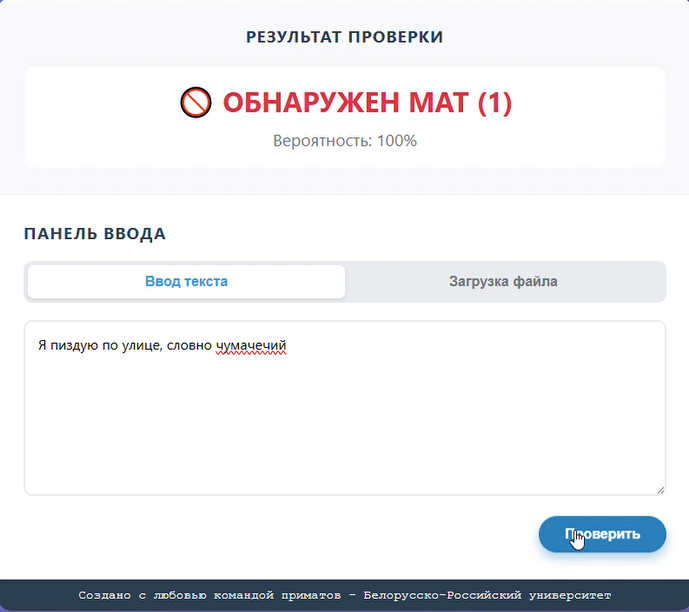
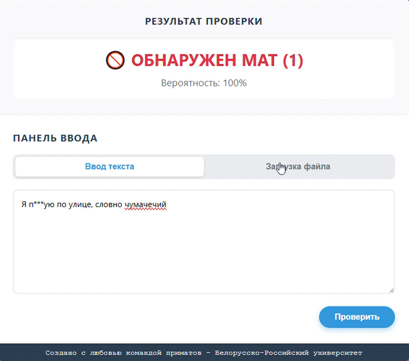
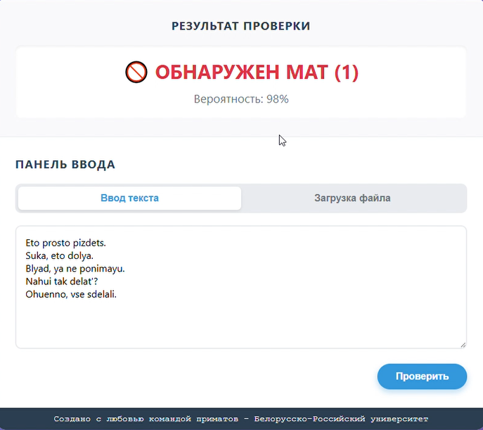

# Smart Moderator: AI-решение для модерации отзывов Wildberries

**Проект в рамках хакатона "The Hackathon: AI Era", кейс №2 от Wildberries.**

**Smart Moderator** — это готовый к интеграции MVP (Minimum Viable Product), предназначенный для автоматического определения нецензурной лексики в русскоязычных текстах. Решение основано на дообученной нейросетевой модели `ruBERT-tiny2` и упаковано в высокопроизводительный FastAPI-сервис.

**Ключевые достижения:**
- **Высокая точность:** F1-score **0.97** на валидационной выборке.
- **Робастность:** Уверенно распознает не только явный мат, но и завуалированные формы (транслит, символы-разделители, "звездочки").
- **Готовность к Production:** Решение представлено в виде API с веб-интерфейсом для демонстрации и пакетной обработки.

---

## 🚀 Демонстрация

Наше решение представляет собой полноценное веб-приложение с интуитивно понятным интерфейсом.

| Текст без мата | Текст с явным матом | Текст с завуалированным матом | Текстовый файл с матом |
| :---: | :---: | :---: | :---: |
|  |  |  |  |

---

## 🛠️ Технический стек

| Категория | Технология |
| :--- | :--- |
| **ML/AI** | `PyTorch`, `transformers` (Hugging Face), `scikit-learn` |
| **Бэкенд** | `FastAPI`, `uvicorn`, `python-multipart` |
| **Фронтенд** | `HTML5`, `CSS3`, `JavaScript` (Vanilla) |
| **Обучение** | `Jupyter Notebook`, `pandas`, `datasets` |
| **Модель** | `cointegrated/rubert-tiny2` (fine-tuned) |

---

## 📂 Структура проекта

```
.
├── back-front/                  # Папка с готовым MVP
│   ├── models_4/                # Финальная модель и токенизатор (хранится через Git LFS)
│   │   ├── config.json
│   │   └── model.safetensors
│   ├── app_torch.py             # FastAPI-сервер
│   ├── index.html               # Фронтенд
│   ├── script.js
│   └── style.css
│
├── main-update-super.ipynb      # Ноутбук для обучения и fine-tuning модели
├── eval_f1.py                   # Скрипт для оценки модели на тестовых данных
├── profanity_dataset_500.csv    # Тестовый датасет для валидации
└── README.md                    # Этот файл
```

---

## 🔧 Установка и запуск

Для запуска проекта на локальной машине выполните следующие шаги.

### 1. Предварительные требования

- Python 3.9+
- Git и [Git LFS](https://git-lfs.github.com/) (обязательно для загрузки модели)

### 2. Клонирование репозитория

```bash
# Убедитесь, что Git LFS установлен
git lfs install

# Клонируйте репозиторий
git clone https://github.com/your-username/your-repo-name.git
cd your-repo-name
```
> **Важно:** Модель хранится с использованием Git LFS. Во время `git clone` файлы модели должны загрузиться автоматически. Если этого не произошло, выполните `git lfs pull`.

### 3. Настройка окружения и зависимостей

```bash
# Перейдите в папку с приложением
cd back-front

# Создайте и активируйте виртуальное окружение
python -m venv venv
# Windows:
venv\Scripts\activate
# macOS/Linux:
source venv/bin/activate
```

### 4. Запуск бэкенда (API)

```bash
# Находясь в папке back-front, запустите сервер
uvicorn app_torch:app --reload
```
Сервер будет доступен по адресу `http://127.0.0.1:8000`.

### 5. Запуск фронтенда

Самый простой способ — использовать расширение **Live Server** для Visual Studio Code.
1. Откройте файл `back-front/index.html`.
2. Нажмите правой кнопкой мыши и выберите "Open with Live Server".
3. В браузере откроется страница с интерфейсом приложения.

---

## 🧠 Подход к решению

Наш подход состоял из нескольких ключевых этапов для достижения максимальной робастности и точности.

### 1. Предобработка и деобфускация
Мы разработали кастомную функцию (`super_clean_text`) для "нормализации" текста перед подачей в модель. Она решает следующие задачи:
- **Транслитерация:** `cyka` → `сука`
- **Удаление разделителей:** `б.л.я.т.ь` → `блять`
- **Нормализация букв:** `ё` → `е`, `сууука` → `сука`
- **Замена "звездочек"**: `п*здец` → `пизд` (корень)

### 2. Аугментация данных
Для повышения устойчивости модели к новым видам обфускации мы применили аугментацию: на основе существующих матерных текстов мы сгенерировали тысячи новых примеров с "растянутыми" словами и случайными разделителями.

### 3. Fine-tuning модели
Мы дообучили `ruBERT-tiny2` на расширенном и очищенном датасете. Для борьбы с дисбалансом классов (чистых текстов гораздо больше) мы использовали **взвешивание классов (Weighted Loss)**, что заставило модель уделять больше внимания редким, но важным примерам с матом.

---

## 📖 Словарь матерных слов (в процессе)

Здесь собрана информация о том, какие слова наша модель может фиксировать. Приведены начальные формы слов. Словарь не является полным. 

|  |  |  |
| :--- | :--- | :--- |
| хуй | пизда | блядь |
| ебальник | сука | мудак |
| гандон | пидор | долбоеб |
| заебал | похуй | пиздец |
| еблан | жопа | мразь |
| ублюдок | ссанина | трах |
| пезда | хер | срака |
| пердак | шлюха | проститутка |
| педофил | чмо | гей |
| залупа | | |
|  | | |

---

## 🎯 Оценка качества

В качестве примера приводим оценки модели, лежащей в ```models_4```.

На валидации (80% данных):

**Результаты:**
- **F1-score (binary): 0.971**
- **Accuracy: 0.992**
- **Precision (class 1): 0.96**
- **Recall (class 1): 0.98**

На датасете ```profanity_dataset_500.csv``` (модель обучена на всех данных):

**Результаты:**
- **F1-score (class 0): 0.95**
- **F1-score (class 1): 0.91**
- **Accuracy: 0.93**
- **Precision (class 1): 0.94**
- **Recall (class 1): 0.88**

Это подтверждает высокую эффективность и надежность нашего решения.